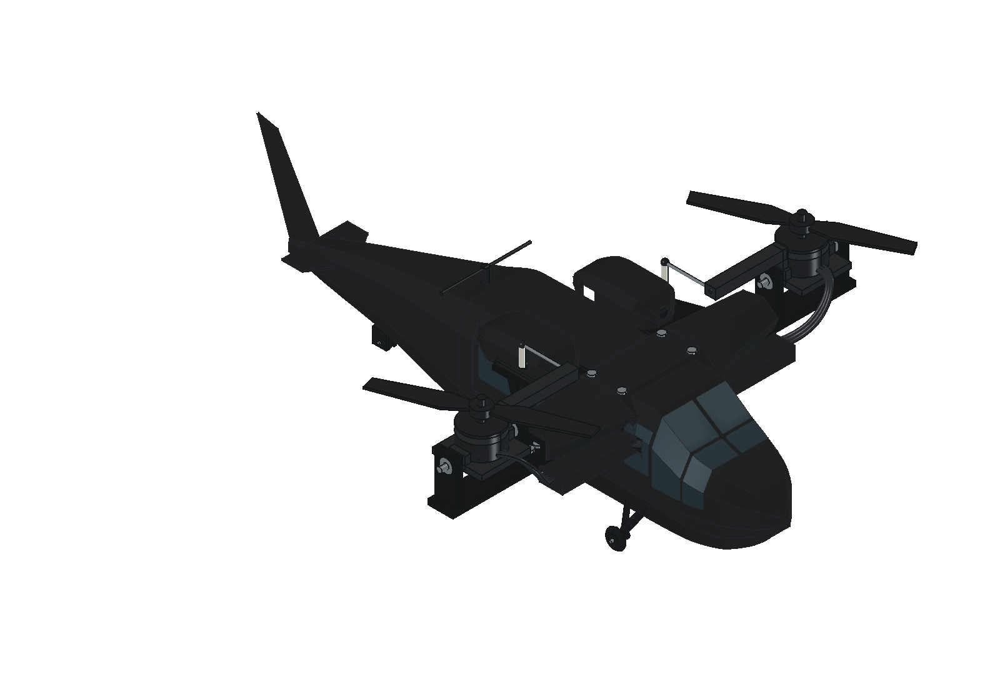
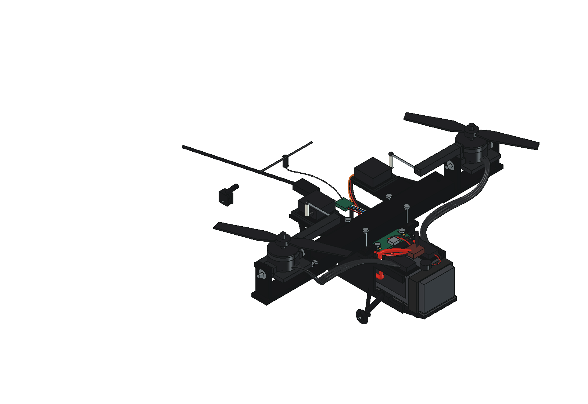

# Kestrel Mini R4

Black Hawk inspired bicopter in matte black, built in FreeCAD. Two propulsion motors, two tilt servos; optional guards are hidden in the baseline view.

**665 g estimated / 731 g with 10% growth. Preliminary design; not flight released.**

Open [the FreeCAD assembly](cad/Kestrel_Mini_R4.FCStd) or run `OPEN_KESTREL.FCMacro` inside FreeCAD for the shell switch and tilt sliders. [STEP assembly](cad/Kestrel_Mini_R4.step) is also included.

Read [the independent flight audit](engineering/INDEPENDENT_FLIGHT_AUDIT.md), [the engineering review](engineering/ENGINEERING_REVIEW.md) and [wire schedule](engineering/WIRE_SCHEDULE.md) before printing or buying. `stl/` contains 40 installed fit-prototype parts sized for the Centauri Carbon. `stl/optional_guards/` contains the two optional guards, totaling 25.4 g. Exact hardware interfaces and physical acceptance tests remain open.

Calculations predict enough lift near the nominal mass, with roughly 3–4 minutes of hover on a 4S1300 pack. The screenshot's four-cell 21700 pack would put this design around 799 g before contingency, so it is not the baseline.
