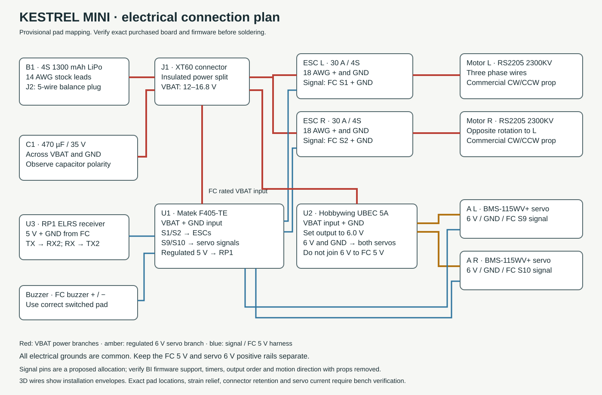

# Kestrel Mini R4 — engineering prototype

Designed in FreeCAD, 9 September 2026. Revision reflects the requested matte-black Black Hawk inspired silhouette: short rounded nose, sloping windshield, rectangular cabin windows, hollow roof fairings, low tail boom, swept fin and wheel gear. Original geometry inspired by the user's larger Samson model; no original CAD was overwritten. The two screenshot parts lists are references, not commands. No parts have been bought.

**Digital design and preliminary feasibility only. The aircraft has not been built, weighed, thrust-tested, structurally proof-tested, or flown. CAD cannot certify that it will fly.** This package is suitable for design review and fit prototypes; it is not a released flight kit.

## Main result

The calculated nominal build is **665 g**, including a **77 g installation allowance**. The budget with 10% growth is **731 g**, leaving **69 g** below the user's 800 g ceiling. Printed material is **251 g**, evaluated at full CAD solid volume and a conservative assumed 1.24 g/cm³. This is not a slicer prediction or measured print mass.

There are **167 modeled objects including two optional guards**, **40 installed printable pieces**, and **42 individually modeled wire routes**. Rotor center spacing is 234 mm and prop diameter is 127 mm, giving 361 mm overall rotor span without guards. The swept fin gives approximately 386 mm overall length. Optional guards have 142.2 mm OD and 376.2 mm overall span. Body dimensions are not a uniform scale of the old design. The old package recorded 2699.9 g before contingency; this design is about 75% lighter on its own mass basis.

At nominal mass, the reference calculation with an assumed installation factor gives vertical thrust/weight of 1.82 at 12 V and 2.29 at 16 V, with installed thrust assumed to be 85% of the manufacturer stand result. Expected static hover duration is roughly **3–4 minutes** using 80% of nominal pack energy. Airflow obstruction, battery aging, wind, maneuvering and actual material mass can worsen this.

**The model predicts enough static lift at nominal weight. Maneuvering and stable controlled flight are not yet established.** The independent audit in `INDEPENDENT_FLIGHT_AUDIT.md` corrects the earlier servo-gyro omission and shows the sensitivity to weight and installed thrust. The 85% factor is an assumption, not a measured conservative bound. Keep the initial build near the nominal mass. At the 800 g ceiling, low-voltage tilt reserve is substantially weaker. The baseline omits the guards. Fitting both adds 25.4 g, taking nominal mass to 690 g. No positive thrust gain is credited to them. Current screens below are analytical limits; hardware has not been configured to enforce them.

## What to open

- `cad/Kestrel_Mini_R4.FCStd`: native FreeCAD assembly, individual objects, mass properties, named nets and grouped electronics.
- `cad/Kestrel_Mini_R4.step`: neutral assembly, commercial components represented by simplified installation envelopes.
- `OPEN_KESTREL.FCMacro`: open the model with independent tilt sliders and a shell on/off switch. Wiring depicts neutral installation; flexing wires are hidden when articulating.
- `stl/`: installed fit-prototype parts, moved to positive print coordinates; optional guards are in their own subfolder. Propellers are deliberately excluded.
- `engineering/calculations.json`, `inventory.json`, `final_clearance_report.json`, `wiring_routes.json`: reproducible detailed evidence.
- `scripts/build_freecad.py`: dimension-driven generator; edit the geometry parameters in this source and rebuild inside FreeCAD. The DesignBasis spreadsheet is documentation, not live constraint linkage.

## Two motors and maneuvering

Yes: two independently controlled, counter-rotating propulsion motors plus two independent tilt servos provide the four primary control inputs. Collective thrust controls climb/descent, differential thrust controls roll, common fore/aft rotor tilt supplies pitch/forward-backward control, and differential fore/aft tilt supplies yaw. Sideways motion uses banking; this is not six independently actuated axes. A supported flight controller mixes and stabilizes these coupled motions. A tail rotor is not required in this arrangement. The tail fin is a body feature, not a substitute for active stabilization. Betaflight lists its BI airframe with two motors and two servos [7].

## Mass and balance

| Allocation | Grams |
|---|---:|
| Installed printed airframe, shell, cradles, gear and mounts | 250.9 |
| Purchased components already allocated in CAD | 337.0 |
| Harness and secondary connectors | 36 |
| Additional screws, nuts, spacers and retention hardware | 25 |
| Straps, foam, ties and insulation | 8 |
| Adhesive and light finish | 8 |
| Nominal | 664.9 |
| With 10% growth | 731.4 |

The purchased total includes two motors (60 g), two props (6 g), two ESCs (16 g provisional), two Blue Bird digital servos (24 g planning), FC (10 g), receiver including antenna (2.2 g), UBEC (21 g), battery with stock leads (170 g allowance), main XT60 (4 g), input capacitor (3 g), buzzer (2 g), four MR104 bearings (5.2 g assumed), metal trunnions (8 g assumed), two horns (1.6 g) and links (4 g). The supplementary hardware and harness allowances intentionally remain even where simplified zero-mass CAD markers exist. Some stock wire mass is also covered conservatively by the harness floor. Nothing is reclaimed as fictitious margin.

Coordinate convention: +X nose/forward, +Y left, +Z up. Origin is midway between rotor axes in plan at z=0; actual transverse pivots are at z=35 mm. Estimated all-up CG = **(-0.82, -0.03, 4.44) mm**. Nominal pitch moment arm from CG to pivot is **30.6 mm**. Sliding the battery is the balancing adjustment. Target actual CG within ±2 mm in X/Y of the pivot centerline; do not assume a low battery makes a bicopter passively stable. The estimated X error implies about 1.5° geometric trim, with final correction based on measured CG. The nominal calculation is inside the ±2 mm target; measure and trim the assembled aircraft. The layout places the battery center at x=39 mm and relocates the XT60, balance plug and capacitor aft of the pack. Main leads run in side channels; the cosmetic roof covers are hollow.

Bounding-box approximations to the principal inertias are 0.00231, 0.00222, 0.00371 kg·m². These are only model inputs; measure inertia or retune to the built aircraft. A ±50% control-effectiveness range was screened in the simplified simulation.

## Propulsion and energy calculation

Reference is **genuine EMAX RS2205 2300KV with HQ5045BN two-blade props**, with a matched CW/CCW pair. RS2205-S, generic RS2205 clones, different KV, and similarly named triblades are not equivalent evidence. The original EMAX table is retained in `source/motor_2.jpg`. It provides current and thrust at 12 V and 16 V. Piecewise interpolation stays inside those tables; no extrapolation is used.

Equations: required stand thrust per motor = mass/(2 × 0.85); P = 2VI + 5 W hotel load; usable energy = 14.8 × 1.3 × 0.8 = 15.39 Wh; duration = 60E/P. The 15% installation penalty and 5 W hotel load are assumptions. Static data gives no reliable throttle percentage, forward-flight speed, or climb performance.

| Mass g | Loaded V | Hover pack A | Hover W | Vertical T/W | T/W at 20° tilt | Idealized hover min |
|---:|---:|---:|---:|---:|---:|---:|
| 665 | 12 | 19.6 | 235 | 1.82 | 1.71 | 3.9 |
| 665 | 16 | 16.6 | 266 | 2.29 | 2.16 | 3.5 |
| 731 | 12 | 21.9 | 263 | 1.65 | 1.56 | 3.5 |
| 731 | 16 | 18.7 | 300 | 2.09 | 1.96 | 3.1 |
| 800 | 12 | 24.9 | 299 | 1.51 | 1.42 | 3.1 |
| 800 | 16 | 20.9 | 334 | 1.91 | 1.79 | 2.8 |
| 690 | 12 | 20.5 | 246 | 1.75 | 1.65 | 3.8 |
| 690 | 16 | 17.4 | 279 | 2.21 | 2.08 | 3.3 |

The 12 V maximum uses the table's last available 20.7 A point. The 16 V maximum is interpolated at a 24 A per-motor screen to leave nominal room below the 30 A ESC rating. At 16.8 V fresh-pack full throttle, current may exceed this screen; measure it before selecting output limits, prop or ESC. A throttle cap is not a closed-loop current limit. Cooling and transient margin must be verified. Do not claim the printed guards contain a failed propeller.

Ideal actuator-disk hover power is 66.8 W using sea-level density 1.225 kg/m³ and two 127 mm disks. The much larger electrical prediction reflects real small-prop, motor and installation losses. No CFD has been performed.

The screenshot’s 21700 option leaves inadequate mass reserve in this design: four cells at a 71 g maximum each plus 20 g pack integration make a 304 g 4S1P pack. Substitution alone gives **799 g before growth allowance**, and **879 g with 10% growth**. The larger pack also requires a different tray/body. A single cell is not a 4S pack. The user-linked listing distinguishes 40 A without thermal cutoff from the 90 A thermally constrained rating; neither is credited as a tested aircraft pack capability. No custom cell pack is modeled or recommended for the initial build.

## Mechanical and control checks

The motors tilt about transverse bearing-supported axes. Cradles and commercial motor/prop envelopes move together; optional guards follow the same pivots when fitted. Four 4×10×4 mm bearings and metal trunnions support the rotors; servos do not carry the rotor's main bending load. Two 14 mm horns with roughly 35 mm links give nominal 1:1 motion. Exact shoulder-bolt retention, washers, spline/horn fit and servo mounting ears remain received-hardware interfaces, not certified machined drawings.

At hover, define inputs [dTL,dTR,dL,dR] and outputs [vertical force, roll moment, pitch moment, yaw moment]. With d=0.117 m, h=0.0306 m and each hover thrust T, the allocation is:

```
Fz = dTL + dTR
Mx = d (dTL - dTR)
My = h T (dL + dR)
Mz = d T (dR - dL)
```

The allocation determinant is nonzero (-0.0177861), so the four local controlled quantities have independent authority. This does **not** establish full-flight stability: common tilt also creates horizontal force, gyroscopic/reaction torques couple axes, servos have delay and backlash, and the aircraft is underactuated in translation. Opposite motor rotation and correct mirrored servo signs must be proved with props removed. No 90° conversion or wing-borne flight is intended.

An attitude-only actuator-lag model was integrated for 18 pitch/yaw cases: initial 10° error, lag 40/80/150 ms, gain ratio 0.5/1.0/1.5, ±20° command limit, 2 rad/s tilt-rate bound, 2 ms steps. All 18 ended within 0.5° at 8 s. These are **synthetic numerical responses, not FreeCAD dynamics, hardware-in-loop tests, or flight-controller PID values**. Translation, aerodynamic damping, pure transport delay, vibration and sensor/firmware behavior are not included. `analyze.py` reproduces every trace. Do not copy the model gains to a flight controller.

For the 24×14 mm, 2 mm wall crossbeam: I=3821 mm⁴. With 10.1 N per side and 90 mm effective cantilever, nominal stress is 1.67 MPa and deflection 0.43 mm at an assumed E=1500 MPa. Applying a local factor 2 gives 3.33 MPa; against an **assumed** 5 MPa working limit the screening margin is 1.50. It is a beam calculation, not FEA. It does not qualify layer adhesion, bolt holes, creep, fatigue, wheel gear, optional bonded spokes, local buckling or impact resistance.

The selected Blue Bird servo’s published 6 V catalog torque is 5.5 kg·cm = 0.539 N·m. The chosen quarter-catalog working screen is 0.135 N·m; this is not a manufacturer continuous rating. The base thrust-offset, gravity, acceleration and harness load totals 0.0372 N·m. Adding a conservative radial-mass-bound gyroscopic case at 24,600 RPM and 45°/s body roll gives 0.0735 N·m and 1.83× margin against that chosen screen. The RPM, rotor inertia, harness drag and loaded tracking still require measurement. Neither the larger torque number nor a digital input rate establishes dynamic stability.

The ±10° pod / ±10° bank / ≤45°/s rate envelope is only a proposed qualification candidate. It is not implemented in firmware or established as safe flight limits. Simultaneous pitch and yaw share the pod angles: abs(common tilt)+abs(differential tilt) must remain within the absolute limit. The independent audit shows sensitivity and the much weaker reserve at higher rates.

The 52 mm printed crank extension (8×7 mm section) screens at 4.55 MPa and 0.78 mm for a 0.08 N·m actuation screen. This does not resolve spline/fastener stress. Body roll creates gyroscopic torque about each servo tilt axis. Prop and motor-bell inertia, RPM and roll rate must be included; opposite prop rotation does not remove each servo’s local load. See the added gyroscopic cases in calculations.json and the independent audit. The stronger servo does not strengthen this printed crank or establish its fatigue life.

## Digital clearance result and limitations

- Valid physical B-reps: 167 / 167.
- All printable bounding boxes fit within the 256 mm Centauri Carbon build envelope; every dimension is below 244 mm.
- All 42 exported print meshes are closed, including the two optional guards.
- Prop annulus positions checked: 22, in 5° increments from −25° to +25° on each side. Blade-height envelope is 5 mm, excluding the 15 mm hub/motor radius.
- Prop-to-fixed intersections: 0. Smallest nominal sampled prop-to-fixed clearance: 9.91 mm.
- Electronics/structure and principal component-pair intersections: 0.
- Moving guard/cradle versus fixed-object intersections: 0.
- Neutral wiring: 42 routes and 179,487 sampled points; no confirmed sampled overlaps in the final screen. Main leads versus nonterminal electronics and the splice versus shell also pass that approximate screen.
- All three wheels lie on z = −56 mm; wheel/fork BRep intersections are zero. Metal axles are intentional contacts.

Fixed-part BRep completion: **True**. Wire sampling completion: **True**. See `final_clearance_report.json`, `wire_sampling_check.json`, `mesh_checks.json`, and `landing_gear_check.json` for the separate methods and evidence.

The wire check reconstructs the canonical centerlines, confirms their lengths against saved CAD, samples every approximately 0.5 mm with 16 points on each of two radial rings plus center points, and classifies points against meshes requested at 0.05 mm linear deflection. It requires agreement between two ray directions. This is finite approximate sampling, not a continuous intersection proof. Matching service passages are cut using the same route with radius increased by 0.6 mm and recorded as constructive exclusions, not claimed independently Boolean-verified. A slow earlier wire/shell Boolean run was superseded by this bounded method.

The revised routes avoid the windshield, rise behind the ESCs through defined FC-deck passages, clear motor-cradle edges, pass through cabin pillars beside the enlarged windows, and enter the antenna mast along a straighter riser. The buzzer was moved above the battery to remove a component-envelope overlap. **These checks do not simulate moving-wire deformation, screw-tool access, manufacturing tolerance, prop flex, bearing play, heating, fatigue or impacts.** Maintain at least 3 mm measured loaded prop clearance after those effects; the CAD number is not that measurement. Optional guard radial gap is 6 mm at neutral.

## Electrical architecture



4S battery → XT60 → insulated star power splice → two ESCs, FC battery input, dedicated 6 V UBEC, and 470 µF/35 V low-ESR capacitor across the bus. All grounds share a reference. FC internal 5 V powers the receiver and buzzer; the separate 6 V positive only feeds servo positives. **Never connect the 6 V servo positive to FC 5 V, and never parallel the regulator positives.** ESC main current bypasses the FC's integrated current sensor in this layout, so that sensor does not measure total aircraft current. Battery alarms must be voltage based unless a correctly integrated external current sensor is added.

| Function | Connection | Requirement |
|---|---|---|
| Left ESC signal | FC S1 / PC9 | OneShot125 or supported PWM; calibrate exact ESC |
| Right ESC signal | FC S2 / PC8 | Same protocol as left; these share TIM8 |
| Left servo signal | FC S9 / PB14, servo resource 1 | Separate TIM12, initialize at 50 Hz |
| Right servo signal | FC S10 / PA6, servo resource 2 | Separate TIM13, initialize at 50 Hz |
| Receiver TX | FC RX2 / PA3 | CRSF, not the inverted SBUS pad |
| Receiver RX | FC TX2 / PA2 | CRSF telemetry |
| Receiver power | FC 5 V and GND | RP1 is a 5 V receiver |
| Servo power | Dedicated UBEC 6 V and GND | Verify with meter before connecting |
| Buzzer | FC BZ+ / BZ− | Active 5 V buzzer; verify polarity |
| Battery balance connector | Four cells / five taps | Only for compatible balance charging and checking |

Matek target pins were checked against the pinned manufacturer-config repository. Actual firmware must contain `USE_SERVOS` and `USE_UNCOMMON_MIXERS`; the BI mixer is conditional in current source. Confirm `mixer list` includes BI, actual output resources and signal waveforms. The ESC named here is older BLHeli hardware: do not assume DShot or bidirectional telemetry. Blue Bird specifies input rates up to 333 Hz; initialize at 50 Hz for output mapping and verify actual timing before raising it. Input frame rate is not loaded mechanical bandwidth.

UBEC manufacturer rating: 5 A continuous, 2–8S input, selectable 5/6/7.4 V. Use 6 V; no 15 A burst credit. Require measured combined servo current below 4 A in the worst intended maneuver, with no FC reset or servo-rail collapse. Servo stall current was not established from the exact digital-servo datasheet. Never deliberately hold a stalled servo as a continuous load. Verify transient performance with the real harness and temperature.

Phase extensions are modeled as 18 AWG silicone wire; retain only necessary OEM 20 AWG tails. ESC power branches are 18 AWG, main battery leads 14 AWG, servo branches 24 AWG, signals generally 26 AWG. Main wire resistance and I²R examples are in `calculations.json`. Copper resistance is evaluated at 20°C and must be increased for temperature. The JSON also screens 49 A in each main lead and 24 A in each branch as an upper electrical load case; those heating values are not approved continuous ampacities. Phase RMS current is not identical to measured battery current; those heating examples are screening assumptions, not ampacity ratings. Prefer short soldered, strain-relieved joints over heavy bullet connectors. Verify polarity, insulation, branch heating and motor direction on the bench.

## Provisional shopping specification

| Qty | Part | Design basis / status |
|---:|---|---|
| 2 | Genuine EMAX RS2205 2300KV | 27.9 mm diameter, 31.7 mm overall, 16×19 mm M3 pattern, 30 g each. Legacy availability; kit may supply four. |
| 1 pair | HQ5045BN two blade, CW + CCW | Exact thrust reference. Commercial balanced propellers; never use the visual CAD blades as print files. |
| 2 | EMAX Lightning 30A ESC | 4S-capable older OneShot/PWM design; 27×12×5 mm / 8 g reserved envelope is provisional. Verify stock and exact dimensions. |
| 2 | Blue Bird BMS-115WV+ digital metal gear | 23.2×10×23 mm body, 12 g planning each (catalog 11±0.5 g), use 6 V, 25T OEM matching horns. Shaft/ear locations are provisional until measured. |
| 1 | Matek F405-TE | 36×46 mm, 10 g, target MATEKF405TE_SD. Board mounting holes and exact component stack need confirmation. |
| 1 | RadioMaster RP1 V2 + antenna | 13×11×3 mm, 2.2 g. Pair with a compatible 2.4 GHz ELRS transmitter. |
| 1 | Hobbywing UBEC 5A | 50×17×10 mm, 21 g, set to 6 V. |
| 1 | Tattu-class 4S 1300 mAh LiPo | Select actual SKU ≤76×38×31 mm, ≤170 g; source's 72×36×29 mm soft pack is the dimensional reference. No C-rating proof assumed. |
| 4 | MR104 bearings, 4×10×4 mm | Purchased metal bearings; print only the housings. |
| 4 | 4 mm smooth shoulder trunnions + retention | Metal; exact stack, threads, shims and locking design require hardware fit. |
| 2 | 14 mm effective-radius OEM horns + M2 ball links | Correct spline; about 35 mm link center distance; no unsupported printed servo splines. |
| 1 | 470 µF / 35 V low-ESR input capacitor | Included Matek candidate, modeled separately; verify installed ripple/transients. |
| 1 | XT60 pair and 4S balance connector | Polarity and strain relief required. |
| 1 | Active 5 V buzzer | Connect to FC switched buzzer pins. |
| set | M3/M2 screws, nuts, spacers, straps, silicone wire | Full allowance retained; detailed receipt-based fastener release remains open. |
| ground | ELRS transmitter, 4S balance charger, wattmeter/thrust stand | Not airborne mass. FlySky transmitter in the screenshot does not bind to RP1 ELRS. |

No purchases were made. Links below are evidence and sourcing starting points, not a confirmed all-in-stock procurement release. The exact legacy motor/prop pair is essential to the calculations; substitute modern parts only with a new matched thrust table and interface update.

## Centauri Carbon print and assembly plan

The cosmetic fuselage and glazing use 1.0 mm nominal walls; roof pods use approximately 1.1 mm walls. These skins are not credited as the primary load-bearing frame.

The model maximizes printed airframe content: keel, crossbeam, bearing yokes, motor cradles, guards/spokes, trays, covers, antenna mast, tail, wheel struts and wheels. Bearings, trunnions, fasteners, motors, OEM servo horns, wiring, batteries and high-speed propellers remain purchased functional parts.

For fit coupons use ordinary PETG. For flight-critical hot motor cradles and highly loaded yokes, qualify a tougher heat-resistant filament such as suitable PA-CF with its manufacturer drying and print process on this printer. The mass analysis retains 1.24 g/cm³ for every printed solid; material strength is **not** inferred from the Centauri Carbon name or a generic carbon-filled filament label. Avoid PLA for hot loaded motor interfaces. Final material/process selection is open.

Start with 0.4 mm nozzle, 0.20 mm layers, 4–6 perimeters for structural parts; use more local shells at bolts rather than arbitrary overall infill. Thin shells are designed as material solids, not solid-filled fuselage volumes. Print the crossbeam flat with its long span in the XY plane, yokes with bearing axes vertical where practical, and motor cradles with continuous load paths across layers. Supports and reorientation are needed on several parts. Export coordinates only place each part above z=0; **they are not fully optimized print orientations or a ready-to-run slicer project**.

Calibrate 4 mm shaft and 10 mm bearing bores using small clearance coupons first. Never force a bearing into a cracked printed wall or clamp across both bearing races. Deburr wire apertures, add local insulation/strain relief, and keep antenna active elements away from conductive composite materials. Printed guards need bonded/fastened spoke attachment proof. Their present interface is suitable for a fit prototype; it is not a verified production joint.

Assembly sequence: weigh prints → fit shafts/bearings and verify free motion → dry-fit motors and horns with no props → assemble keel/crossbeam/wheel gear → mount battery and FC on isolators → install ESCs/UBEC/receiver → route and secure wiring → fit removable shells → measure CG → calibrate/motion-test with no props → only then perform a restrained propulsion and vibration test. Balance the actual final assembly before flight. Perform canopy retention, linkage backlash and fastener-locking verification on received hardware.

| Printable object | Full-solid mass g | Bounding box mm | Solids |
|---|---:|---|---:|
| P01_Battery_keel | 35.3 | 136.0 × 58.0 × 48.0 | 1 |
| P02_Crossbeam | 45.2 | 73.0 × 168.0 × 19.0 | 1 |
| P03_Avionics_deck | 6.3 | 54.0 × 49.0 × 4.0 | 1 |
| P09_Cabin_side_glazing_0 | 0.5 | 18.0 × 4.5 × 27.0 | 1 |
| P09_Cabin_side_glazing_0_segment_2 | 1.1 | 28.0 × 4.8 × 28.0 | 1 |
| P09_Cabin_side_glazing_0_segment_3 | 1.0 | 28.0 × 5.3 × 28.0 | 1 |
| P09_Cabin_side_glazing_1 | 0.5 | 18.0 × 4.5 × 27.0 | 1 |
| P09_Cabin_side_glazing_1_segment_2 | 1.1 | 28.0 × 4.8 × 28.0 | 1 |
| P09_Cabin_side_glazing_1_segment_3 | 1.0 | 28.0 × 5.3 × 28.0 | 1 |
| P06_Cabin_upper | 25.7 | 210.0 × 62.0 × 51.0 | 1 |
| P07_Cabin_lower | 23.0 | 208.8 × 62.0 × 17.0 | 1 |
| P08_Windshield | 1.4 | 20.0 × 29.9 × 40.0 | 1 |
| P08_Windshield_segment_2 | 0.7 | 12.5 × 28.8 × 26.3 | 1 |
| P08_Windshield_segment_3 | 1.4 | 20.0 × 29.9 × 40.0 | 1 |
| P08_Windshield_segment_4 | 0.7 | 12.5 × 28.8 × 26.3 | 1 |
| P19_Tapered_tail_boom | 22.8 | 150.0 × 56.6 × 64.5 | 1 |
| P04_Tail_spine | 3.1 | 163.3 × 12.0 × 35.5 | 1 |
| P05_Vertical_tail_fin | 2.2 | 52.0 × 1.3 × 70.0 | 1 |
| P05_Horizontal_tailplane | 1.6 | 31.0 × 48.0 × 1.2 | 1 |
| P17_Shoulder_cowl__1 | 4.3 | 46.0 × 52.0 × 20.0 | 1 |
| P20_Servo_engine_cowl__1 | 4.3 | 63.0 × 30.4 × 21.0 | 1 |
| P22_Cable_raceway__1 | 4.0 | 17.0 × 54.0 × 10.0 | 1 |
| P10_Main_gear__1 | 1.3 | 27.7 × 17.5 × 26.7 | 1 |
| P23_Main_wheel__1 | 0.6 | 14.0 × 4.0 × 14.0 | 1 |
| P17_Shoulder_cowl_1 | 4.3 | 46.0 × 52.0 × 20.0 | 1 |
| P20_Servo_engine_cowl_1 | 4.3 | 63.0 × 30.4 × 21.0 | 1 |
| P22_Cable_raceway_1 | 4.0 | 17.0 × 54.0 × 10.0 | 1 |
| P10_Main_gear_1 | 1.3 | 27.7 × 17.5 × 26.7 | 1 |
| P23_Main_wheel_1 | 0.6 | 14.0 × 4.0 × 14.0 | 1 |
| P24_Tailwheel_fork | 0.8 | 19.6 × 7.0 × 25.5 | 1 |
| P25_Tailwheel | 0.3 | 11.0 × 3.0 × 11.0 | 1 |
| P11_L_bearing_yoke | 10.6 | 18.0 × 74.0 × 35.0 | 1 |
| P12_L_motor_cradle | 10.4 | 36.0 × 85.0 × 22.5 | 1 |
| P14_L_servo_retainer | 0.6 | 29.0 × 30.0 × 2.5 | 1 |
| P15_L_ESC_tray | 1.2 | 31.0 × 16.0 × 2.0 | 1 |
| P11_R_bearing_yoke | 10.6 | 18.0 × 74.0 × 35.0 | 1 |
| P12_R_motor_cradle | 10.4 | 36.0 × 85.0 × 22.5 | 1 |
| P14_R_servo_retainer | 0.6 | 29.0 × 30.0 × 2.5 | 1 |
| P15_R_ESC_tray | 1.2 | 31.0 × 16.0 × 2.0 | 1 |
| P16_Antenna_mast | 0.1 | 5.0 × 5.0 × 10.0 | 1 |

## Required physical results before free flight

1. Weighed installed mass ≤800 g and preferably close to the nominal calculation; the 800 g ceiling alone does not meet the preferred thrust-reserve gates; CG within ±2 mm X/Y and below the tilt axes. Re-run calculations with measured masses.
2. Fit every received component, nut, shoulder shaft and OEM horn; prove guard/spoke, keel, servo and shell retention. Verify no part depends on friction alone for flight retention.
3. With props removed, verify FC orientation, motor assignment, mirrored servo signs, failsafe and arm/disarm. Confirm loss of radio commands motor shutdown. Capture and retain exact firmware version/configuration. Do not load arbitrary quad PID defaults for flight.
4. Measure thrust/current with the actual prop and chosen guard configuration at full and near-landing loaded voltage. Require at least **1.8× measured weight in vertical total thrust** as a preferred initial-flight gate, and ≥1.6× vertical capacity at maximum intended tilt. This may require reducing weight, limiting tilt, selecting a different prop/motor, or an ESC upgrade.
5. Inspect warm motor/ESC/BEC/wire temperatures, supply sag and servo tracking. Verify ≤24 A per ESC in the selected continuous operating region and adequate surge margin; this is a design gate, not a preconfigured limiter.
6. Loaded articulation through the configured range, realistic harness bending and gentle deflection: ≥3 mm prop clearance, no binding, no conductor rubbing, no bracket cracks. The independent audit proposes ±10° and ≤45°/s body rates only as conservative qualification candidates, not validated safe limits. Retain ±25° only as a checked geometric envelope, and fit positive travel stops before flight.
7. Proof one arm/yoke assembly to 20 N upward static load, inspect creep/deflection and joints; use a fixture, not a hand-held running rotor. Proof landing gear with a representative mass and inspect layer/joint damage. These tests do not establish unlimited fatigue life.
8. Establish low-gain restrained attitude response, check vibration logs and servo backlash, then short low-altitude trials in a suitable clear area. A tether changes dynamics; successful restrained testing is not itself stable free flight.

Open engineering items include exact purchased interfaces/retention details, actual filament allowables and fatigue, motor/ESC/servo temperatures, detailed power transients, flexible-harness fatigue, continuous motion clearance, complete six-degree-of-freedom stability, loaded servo bandwidth, real firmware integration and flight testing. No FEA, wind-tunnel test, hardware-in-loop run, or physical test was represented as performed.

## Source evidence

Sources accessed 9 September 2026. Product specifications are distinguished from modeling assumptions above; prices and stock can change. Source imagery is kept only as dimensional/performance reference.

1. [Original motor and manufacturer dimensions](https://emaxmodel.com/products/emax-rs2205-racespec-motor-cooling-series)
2. [Exact 2300KV / HQ5045BN thrust table](https://cdn.shopify.com/s/files/1/0469/7358/3518/t/3/assets/RS2205-2.jpg?v=1598532544)
3. [Motor / ESC kit](https://shop.emaxmodel.com/products/emax-rs2205-2300kv-2600kv-racespec-brushless-motor-with-3-4s-30a-blheli-lightning-esc-power-combo)
4. [Selected Blue Bird BMS-115WV+ dimensions and torque](https://www.blue-bird-model.com/products_detail/55.htm)
5. [Selected servo manufacturer](https://www.blue-bird-model.com/products_detail/55.htm)
6. [Matek F405-TE hardware, output timers, supply](https://www.mateksys.com/?portfolio=f405-te)
7. [Betaflight BI mixer](https://betaflight.com/docs/wiki/guides/current/Mixer)
8. [Betaflight target pin assignment](https://github.com/betaflight/config/blob/d78c5a23515c8e05534a2989a2415f3fcd76fd19/configs/MTKS/MATEKF405TE_SD/config.h)
9. [Betaflight servo mixer implementation](https://github.com/betaflight/betaflight/blob/9bf37771e1dad564d97245db479ddd7e3191c36a/src/main/flight/servos.c)
10. [Hobbywing 5A UBEC specifications](https://www.hobbywing.com/en/products/ubec-5a93.html)
11. [RadioMaster RP1 V2 receiver](https://www.radiomasterrc.com/products/rp1-expresslrs-2-4ghz-nano-receiver)
12. [Tattu 4S1300 dimensional reference](https://www.genstattu.com/blog/tattu-fpv-battery-recommend)
13. [Tenpower manufacturer cell list](https://www.tenpowercell.com.cn/products/cells)
14. [User-linked Tenpower cell / conditional current ratings](https://www.18650batterystore.com/products/tenpower-50xg-21700-5000mah-90a-battery)
15. [Centauri Carbon build envelope](https://www.elegoo.com/pages/elegoo-centauri-carbon)
